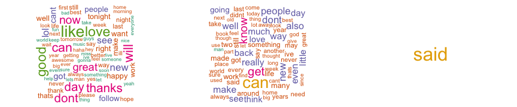

Exploring Text Prediction With Twitter Messages, Blog Posts, and News Articles
========================================================

This report is a concise exploratory analysis to understand a collection of various text files that will be used to build a predictive text algorithm and web application. These text files, used as the training dataset, are a combination of twitter messages, blog posts, and news articles. The primary goal of this report is to create basic summaries of the three files including word counts, line counts, basic data tables, plots, and histograms in order to illstrate features of the data. 

The fundamental components of this analysis can benefit the company in many ways. To list two; embedding text auto-complete in the internal email system or propriety productivity report generator and classifying previous client proposals as either successful or failures in order to create future rate proposals. The data can be downloaded from this [link]("https://d396qusza40orc.cloudfront.net/dsscapstone/dataset/Coursera-SwiftKey.zip") and the entire underlying code for this report can be found [here]("http://github.com/FrankRuns/natlangproc").     

## Data Aquisition

Download and read the English data set. Using terminal commands we found the following line and word counts

* Twitter Messages: 2,360,148 lines, 30,374,206 words
* Blog Posts: 899,288 lines, 37,334,690 words
* News Articles: 1,010,242 lines, 34,372,720 words

Despite having the largest number of lines, the twitter.txt file is actually the smallest in terms of word count and size. File sizes are as follows:

* Twitter Messages: 159 MB
* Blog Posts: 196 MB
* News Articles: 200 MB

The size of these files creates a memory bandwidth challenge and for that reason we will only load a sample of each of the three files. It is assumed that the entries (entries meaning lines) in all files are randomly distributed.  


```
## [1] "We will use 23000 tweets, 9000 blog posts, and 1000 news articles"
```

With the data loaded, we seek to look at the characteristics of each text source. We'll want to know about typical entry length, word count frequencies, and any prevelant word associations. We make a quick visual inspection of the number of characters in each text source. 

 

It is immediately clear that one is not like the others. Twitter messages are significantly shorter and have a smoother, although still right skewed, distribution. In order to look deeper into word and phrase frequency, we store each text file into a corpus (a collection of written texts).

## Into the Corpus


After initial clean up of the corpora which includes transforming the text to lower case, removing punctuation and numbers, and removing common stopwords we can view snapshots of each corpus:


```
## [1] "Twitter Corpus Snapshot: Summary of Whole Corpus"
```

```
## A corpus with 23000 text documents
## 
## The metadata consists of 2 tag-value pairs and a data frame
## Available tags are:
##   create_date creator 
## Available variables in the data frame are:
##   MetaID
```

```
## [1] "Blogs Corpus Snapshot: Summary of First Two Entries"
```

```
## A corpus with 2 text documents
## 
## The metadata consists of 2 tag-value pairs and a data frame
## Available tags are:
##   create_date creator 
## Available variables in the data frame are:
##   MetaID 
## 
## [[1]]
##  years thereafter oil fields platforms named pagan gods
## 
## [[2]]
##  love mr brown
```

```
## [1] "News Corpus Snapshot: Summary of Entries # 50-52"
```

```
## A corpus with 3 text documents
## 
## The metadata consists of 2 tag-value pairs and a data frame
## Available tags are:
##   create_date creator 
## Available variables in the data frame are:
##   MetaID 
## 
## [[1]]
## another strong month hiring makes less likely federal reserve will take additional steps boost economy meeting next week
## 
## [[2]]
## fire crews battle thousands wildfires california every year map shows areas burned largest wildfires includes data california department forestry fire protection federal agencies including us forest service fires shown estimated burned acres data include grass fires burned fewer acres
## 
## [[3]]
##  sw raleighview ct square feet
```

This gives us a sense of our corpora from which we create the term document matrices. 


The number of words that occur more than 200 times in each text source varies greatly. It is interesting to see similarity between twitter messages and blogs with news standing alone this time.


```
## [1] "Twitter message terms that occur more than 200 times: 98"
```

```
## [1] "Blog post terms that occur more than 200 times: 86"
```

```
## [1] "News article terms that occur more than 200 times: 1"
```

 

Finally, words tend to happen together. For the most frequent word found in each file sample, which words are most stringly associated with that word.


```
##          just
## finished 0.09
## saw      0.09
## got      0.07
## realized 0.07
## wanted   0.06
```

```
##           one
## another  0.17
## baktun   0.15
## calender 0.15
## katun    0.15
## katuns   0.15
## kin      0.15
## tun      0.15
## tuns     0.15
## winal    0.15
## winals   0.15
## get      0.13
## just     0.13
## can      0.12
## diseased 0.12
## mayans   0.12
```

```
##        said
## police 0.22
## build  0.19
```

## Summary and Next Steps

We are working with three large text files in order to build a predictive text algorithm. The blogs and news files have approxamitely 1mm entries totat and the twitter file has twice that total, of which we used a 1% sample. The blogs and news file entries have similar structures (# charachters, average length of entry), but the blogs and twitter entries tend to share similar languistic characteristics (frequent words). Word associations are stronger in the news file than the blogs and twitter files which may indicate less word variety in news entries than blog entries and twitter messages. As a final check, let's look at the number of unique terms in each term document matrix. As we would expect, the news matrix has fewer terms than the other two.


```
## [1] "The twitter term doc matrix has 25153 unique terms."
```

```
## [1] "The blogs term doc matrix has 29213 unique terms."
```

```
## [1] "The news term doc matrix has 7566 unique terms."
```

Each file adds to the diversity of our 'natural language' upon which to build the Shiny app. In order to build the predictive text algorithm these are the steps that will be taken.

1. Use ngram term document matrix to build simple predictive model. This will utilize 4gram, 3gram, and bigram models.
2. Explore better options for handling swear words. This app will not suggest profanity.
3. Research methods to improve speed of initial model. This includes alternative R packages and hosted servers such as Amazon Web Services.
4. Improve accuracy of the inital predictive model. This includes better understanding of punctuation and word associations. Perhaps classifying the document as a twitter message, blog post, or news article will help in selecting the 'correct' prediction.
5. Contemplate visualizations that will be useful to end user. At this point, a list of likely next words (rather than just one) and the cooresponding probability is the only thing that comes to mind.
6. Build the r.server and r.ui files for the shiny app.

Any and all suggestions for improvement of workflow greatly, greatly, greatly appreciated. Thank you for reading this report.
